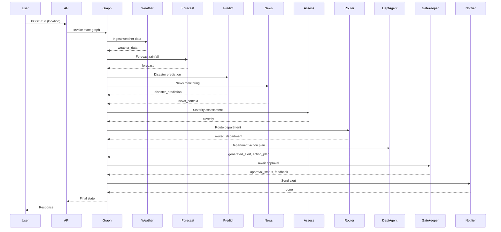

# Architecture

## Overview

The system is a hybrid pipeline: deterministic ML (forecast + classifier) followed by LLM-based severity assessment, routing, and a human approval gate. It is orchestrated by LangGraph and exposed via FastAPI.

## Frontend Architecture

- **Framework:** Next.js App Router with TailwindCSS and shadcn/ui.
- **Pages:** Dashboard (/), History (/history), Settings (/settings).
- **Component hierarchy:**
  - `layout.tsx` -> App shell + top navigation
  - `page.tsx` -> Dashboard sections
  - `components/dashboard/*` -> cards, chart, status pill, map picker
  - `lib/api.ts` -> typed API client
  - `lib/types.ts` -> shared data shapes

## Frontend API Integration

- `POST /run` executes the LangGraph workflow.
- `GET /pending` supplies alert details during gatekeeper review.
- `POST /approve` / `POST /reject` finalizes the approval decision.
- `GET /memory` and `GET /runs` hydrate the memory history and run log.

## Map -> Backend -> Weather API Flow

- Operators select a location via the map or Nominatim search.
- The frontend sends `lat`, `lon`, `location_name` to `POST /run`.
- The weather ingestion node calls Open-Meteo using coordinates.
- The remaining graph stages consume the resulting weather data.

## Run ID Propagation

- `run_id` is generated at the API boundary and injected into LangGraph state.
- Approval decisions, persistent memory, and run history entries store `run_id`.
- Frontend approval actions must supply a specific `run_id`.

## Node Details

- **Environmental Data Ingestion**
  - **Inputs:** `location`
  - **Outputs:** `weather_data`
  - **Behavior:** Calls Open-Meteo, normalizes weather metrics, stores history to CSV.
  - **Failure Handling:** Raises on missing lat/long or API failure.
- **Time Series Forecasting**
  - **Inputs:** `weather_data`
  - **Outputs:** `forecast`
  - **Behavior:** Prophet forecasts 48 hours of rainfall and generates a plot. Emits a compact feature summary for downstream use.
  - **Failure Handling:** Raises on empty series or invalid data.
- **Disaster Prediction**
  - **Inputs:** `forecast.features`
  - **Outputs:** `disaster_prediction`
  - **Behavior:** RandomForest classifier outputs probabilities and most-likely class.
  - **Failure Handling:** Raises if model is missing or features are incomplete.
- **News Monitoring**
  - **Inputs:** `location`
  - **Outputs:** `news_context`
  - **Behavior:** Pulls location-specific headlines via NewsAPI/GNews.
  - **Failure Handling:** Logs and returns empty list on API errors.
- **Severity Assessor (LLM)**
  - **Inputs:** `forecast.features`, `disaster_prediction`, `news_context`
  - **Outputs:** `severity`, `severity_reason`
  - **Behavior:** Uses LLM to produce strict JSON with severity and rationale.
  - **Failure Handling:** Raises on missing API key or malformed model output.
- **Router**
  - **Inputs:** `severity`
  - **Outputs:** `routed_department`
  - **Behavior:** Maps severity to operational departments (Public Works, Civil Defense, Emergency Response).
- **Public Works Agent**
  - **Inputs:** `location`, `severity`, `news_context`, `forecast`, `disaster_prediction`
  - **Outputs:** `generated_alert`, `action_plan`
  - **Behavior:** Infrastructure-focused response planning (drainage, inspections).
- **Civil Defense Agent**
  - **Inputs:** `location`, `severity`, `news_context`, `forecast`, `disaster_prediction`
  - **Outputs:** `generated_alert`, `action_plan`
  - **Behavior:** Regional coordination and resource staging.
- **Emergency Response Agent**
  - **Inputs:** `location`, `severity`, `news_context`, `forecast`, `disaster_prediction`
  - **Outputs:** `generated_alert`, `action_plan`
  - **Behavior:** Evacuation guidance and urgent response actions.
- **Human Gatekeeper**
  - **Inputs:** `generated_alert`, `action_plan`, `severity`, `routed_department`
  - **Outputs:** `approval_status`, `feedback`
  - **Behavior:** Pauses the workflow and requires human approval via API or terminal input.
- **Alert Sender**
  - **Inputs:** `generated_alert`, `action_plan`, `routed_department`
  - **Outputs:** none
  - **Behavior:** Placeholder to deliver email/SMS alerts once approved.
- **Reflection**
  - **Inputs:** `feedback`, `routed_department`
  - **Outputs:** none
  - **Behavior:** Logs human feedback for review.
- **Memory Update**
  - **Inputs:** `feedback`, `memory_rules`
  - **Outputs:** `memory_rules`
  - **Behavior:** Stores feedback as a rule to guide future runs and persists it to JSON.

## Conditional Routing Logic

- **Severity routing:**
  - LOW/MEDIUM -> Public Works Agent
  - HIGH -> Civil Defense Agent
  - CRITICAL -> Emergency Response Agent
- **Approval routing:**
  - APPROVED -> Alert Sender -> END
  - REJECTED -> Reflection -> Memory Update -> Department Agent retry

## Parallel Execution

- Forecast branches into Disaster Prediction and News Monitoring.
- Severity assessment waits for both branches before routing.

## Memory System

- **Short-term:** `memory_rules` stored in LangGraph state (safety, escalation, approvals).
- **Persistent:** Rules are stored in `backend/memory/rules.json` and retrieved by department agents.
- **Planned:** Integrate a long-term memory store (vector DB) for historical incident context.

## Human Approval Flow

- Gatekeeper pauses execution until approval arrives via API or terminal, keyed by `run_id`.
- Approved alerts are sent by the alert sender node.
- Rejected alerts loop through reflection and memory update before regeneration.

## Persistent Memory vs Retry Loop

- Retry loop regenerates the current alert using immediate feedback.
- Persistent memory stores feedback so future runs apply the rule automatically.

## Model Interactions

- **Prophet:** Generates rainfall forecast for 48 hours.
- **RandomForest:** Consumes forecast features to predict disaster probabilities.
- **LLM:** Fuses ML outputs and headlines into a severity label.

## Prompt Inputs and Data Passing

- Forecast features and classifier probabilities are aggregated into a compact payload.
- News headlines are appended as contextual evidence.
- The LLM receives only structured inputs to keep outputs auditable.

## Failure Handling

- API errors or missing data raise exceptions and halt deterministic nodes.
- News fetch failures log warnings and return empty context.
- LLM failures surface explicitly to avoid silent severity corruption.
- Gatekeeper timeouts raise errors to avoid unbounded waiting.

## Sequence Diagram (Approval Path)

## Why Independent Department Agents

- Each department has different operating procedures, checklists, and alert wording.
- Specialized agents keep outputs consistent and allow targeted upgrades.
- Department modules can be tested and tuned independently without cross-impact.

## Why Human Approval Is Critical

- Automated alerts can cause panic and operational disruption if wrong.
- Human reviewers provide legal and safety oversight.
- Feedback improves downstream policies and alert accuracy.

## Model Retraining

- Execute `python -m backend.models.train_classifier` to regenerate synthetic data, retrain, and persist the classifier.
- Replace synthetic data generation with real datasets when available.

## Dataset Evolution

- **Synthetic (current):** Heuristic rules define labels based on feature thresholds.
- **Real (future):** Replace data generation with curated disaster records; retrain and version models.
