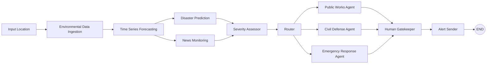

# Autonomous Disaster Management System

## Project Overview

- **Goal:** Provide deterministic, auditable disaster risk predictions and route actions using weather signals plus contextual news.
- **Problem Solved:** Ingest observations, forecast rainfall, classify disaster likelihood, and assess severity for routing.
- **High-Level Workflow:** Input -> Weather ingestion -> Forecast -> (Disaster prediction + News monitoring) -> Severity assessor -> Router -> Department agent -> Human gatekeeper -> Alert sender.

## Architecture Diagram



## Folder Structure

- **backend/**: FastAPI app, LangGraph workflow, agents, models, storage.
- **agents/**: Node implementations (ingestion, forecasting, classification, news, LLM assessor, router, department agents, gatekeeper).
- **graphs/**: LangGraph state and workflow definitions.
- **models/**: ML training, inference, feature spec, and schemas.
- **memory/**: Short-term rules plus persistent memory store (rules.json).
- **api/**: FastAPI entrypoint.
- **storage/**: CSV datasets, plots, and model artifacts.
- **frontend/**: Next.js dashboard UI.
  - **frontend/src/app/**: Dashboard, History, Settings pages.
  - **frontend/src/components/**: UI sections and charts.
  - **frontend/src/lib/**: API client and shared types.

## Tech Stack

- **Backend:** Python, FastAPI
- **Orchestration:** LangGraph
- **Forecasting:** Prophet
- **Classification:** RandomForestClassifier (scikit-learn)
- **LLM Reasoning:** OpenAI-compatible API (configurable)
- **Storage:** CSV + local filesystem
- **Frontend:** Next.js, TailwindCSS, shadcn/ui
- **Maps:** React Leaflet + OpenStreetMap (Nominatim search)

## APIs Used

- **Open-Meteo** (hourly weather metrics)
- **NewsAPI / GNews** (headlines for location context)
- **OpenAI-compatible LLM** (severity assessment)

## Models Used

- **Forecasting:** Prophet
- **Classification:** RandomForestClassifier
- **LLM:** OpenAI-compatible (Gemini/OpenAI-style endpoints)

## Databases / Storage

- **Current:** CSV files, local filesystem for plots and models
- **Planned:** SQLite, ChromaDB, Postgres (future roadmap)

## LangGraph State Schema

- `run_id`: string
- `location`: dict
- `weather_data`: list of dicts
- `forecast`: dict (points, plot_path, features)
- `disaster_prediction`: dict (probabilities + most_likely)
- `news_context`: list of strings
- `severity`: string
- `severity_reason`: string
- `routed_department`: string
- `generated_alert`: string
- `action_plan`: list of strings
- `approval_status`: string
- `feedback`: string
- `memory_rules`: list

## Persistent Memory (Long-Term)

- Stored in [backend/memory/rules.json](backend/memory/rules.json).
- Written by the Memory Update node after rejections.
- Retrieved by department agents before generating alerts.
- Run history stored in `backend/storage/data/runs_log.json`.

## Run ID Tracking

- Each workflow execution generates a UUID `run_id`.
- The ID is stored in state, logs, memory entries, and approval payloads.
- Frontend approvals must target a specific `run_id`.

## Frontend Pages

- **Dashboard (/)**: Workflow control, live outputs, approvals, and memory.
- **History (/history)**: Full run log with timestamps and outcomes.
- **Settings (/settings)**: API base URL and approval mode notes.

## Map -> Backend -> Weather API Flow

1. Operator selects a point on the map or searches via Nominatim.
2. Frontend sends `lat`, `lon`, `location_name` to `POST /run`.
3. Backend calls Open-Meteo using the coordinates.
4. Weather data flows through forecasting, prediction, and routing.

Nominatim search uses OpenStreetMap public endpoints and does not require an API key.

## Component Hierarchy (Frontend)

- `layout.tsx` -> TopNav + App shell
- `page.tsx` -> Dashboard sections
- `components/dashboard/*` -> Cards, chart, status pill, map picker
- `lib/api.ts` -> Backend API client
- `lib/types.ts` -> Shared response shapes

## Node-by-Node Explanation

- **Environmental Data Ingestion**
  - **Input:** `location`
  - **Output:** `weather_data`
  - **Purpose:** Fetch weather metrics (temperature, humidity, rainfall, wind speed, pressure) and store historical CSV.
- **Time Series Forecasting**
  - **Input:** `weather_data`
  - **Output:** `forecast`
  - **Purpose:** Forecast 48-hour rainfall with Prophet and generate forecast plots.
- **Disaster Prediction**
  - **Input:** `forecast.features`
  - **Output:** `disaster_prediction`
  - **Purpose:** Predict disaster class probabilities using a RandomForest classifier.
- **News Monitoring**
  - **Input:** `location`
  - **Output:** `news_context`
  - **Purpose:** Pull location-specific headlines for real-world context.
- **Severity Assessor (LLM)**
  - **Input:** `forecast.features`, `disaster_prediction`, `news_context`
  - **Output:** `severity`, `severity_reason`
  - **Purpose:** Fuse ML signals and headlines into a strict severity classification.
- **Router**
  - **Input:** `severity`
  - **Output:** `routed_department`
  - **Purpose:** Map severity to operational departments.
- **Public Works Agent**
  - **Input:** `location`, `severity`, `news_context`, `forecast`, `disaster_prediction`
  - **Output:** `generated_alert`, `action_plan`
  - **Purpose:** Prepare infrastructure-focused response steps.
- **Civil Defense Agent**
  - **Input:** `location`, `severity`, `news_context`, `forecast`, `disaster_prediction`
  - **Output:** `generated_alert`, `action_plan`
  - **Purpose:** Coordinate regional response and resource staging.
- **Emergency Response Agent**
  - **Input:** `location`, `severity`, `news_context`, `forecast`, `disaster_prediction`
  - **Output:** `generated_alert`, `action_plan`
  - **Purpose:** Issue evacuation-focused actions and urgent response steps.
- **Human Gatekeeper**
  - **Input:** `generated_alert`, `action_plan`, `severity`, `routed_department`
  - **Output:** `approval_status`, `feedback`
  - **Purpose:** Pause workflow until a human approves or rejects the alert.
- **Alert Sender**
  - **Input:** `generated_alert`, `action_plan`, `routed_department`
  - **Output:** none
  - **Purpose:** Placeholder for sending email/SMS alerts after approval.
- **Reflection**
  - **Input:** `feedback`, `routed_department`
  - **Output:** none
  - **Purpose:** Log feedback context before regeneration.
- **Memory Update**
  - **Input:** `feedback`, `memory_rules`
  - **Output:** `memory_rules`
  - **Purpose:** Preserve human feedback for iterative improvements and store it in persistent memory.

## Data Flow

1. Location is submitted to the API.
2. Weather data is fetched and stored to CSV.
3. Prophet forecasts rainfall for 48 hours and emits features.
4. Disaster prediction uses forecast features to output class probabilities.
5. News monitoring fetches relevant local headlines.
6. LLM assessor fuses ML outputs + news into a severity label.
7. Router chooses the response department.
8. Department agent produces an action plan and alert message.
9. Human gatekeeper approves or rejects the alert.
10. Approved alerts are sent; rejected alerts are regenerated with feedback.
11. Rejection feedback is stored in persistent memory for future runs.
12. Results are returned in the LangGraph state.

## Setup Instructions

1. Create and activate a virtual environment.
2. Install dependencies: `pip install -r requirements.txt`.
3. Train the classifier: `python -m backend.models.train_classifier`.
4. Set environment variables (see below).
5. Start API: `uvicorn backend.api.main:app --reload`.
6. Start frontend: `cd frontend` then `npm run dev`.

## Environment Variables Required

- `NEWS_API_KEY`: API key for NewsAPI or GNews.
- `NEWS_PROVIDER`: `newsapi` (default) or `gnews`.
- `LLM_API_KEY`: API key for the LLM provider.
- `LLM_BASE_URL`: Base URL for the OpenAI-compatible API (default: https://api.openai.com/v1).
- `LLM_MODEL`: Model name (default: gpt-4o-mini).
- `APPROVAL_MODE`: `api` (default) or `terminal` for blocking input().
- `APPROVAL_TIMEOUT_SECONDS`: Timeout for approval waiting (default: 900).
- `CORS_ORIGINS`: Comma-separated list of allowed frontend origins.
- `ALLOW_SYNTHETIC_FALLBACK`: Allow synthetic weather data when Open-Meteo fails and no cache exists.
- `AUTO_TRAIN_MODEL`: Auto-train classifier if model file is missing (default: true).
- `NEXT_PUBLIC_API_BASE_URL`: Frontend base URL for backend API (default: http://localhost:8000).
- `NEXT_PUBLIC_NOMINATIM_URL`: Optional override for Nominatim search endpoint.

## How ML Outputs Are Passed Into Prompts

- The forecast node emits a compact `forecast.features` object.
- Disaster probabilities are merged with the feature summary.
- The LLM receives only these distilled signals plus headlines to keep prompts short and auditable.

## Why the LLM Is Added Here

- Upstream nodes remain deterministic and explainable (forecast + classifier).
- The LLM is used only to synthesize signals into a severity label, where qualitative context matters most.

## Why Routing Follows Severity Assessment

- Routing is a policy decision driven by severity, not raw weather data.
- Separating assessment from routing keeps operational logic simple and testable.

## Department Responsibilities and Examples

- **Emergency Response Agent**
  - **Responsibility:** Evacuation, shelters, emergency contacts.
  - **Example Output:** "Emergency Response Alert: CRITICAL Flood risk ..." + evacuation action plan.
- **Civil Defense Agent**
  - **Responsibility:** Resource deployment, coordination, readiness.
  - **Example Output:** "Civil Defense Advisory: HIGH Storm risk ..." + deployment action plan.
- **Public Works Agent**
  - **Responsibility:** Drainage clearing, infrastructure inspection.
  - **Example Output:** "Public Works Notice: LOW Flood risk ..." + infrastructure action plan.

## Why Independent Department Agents

- Each department has distinct procedures and communications.
- Specialized agents make outputs consistent and easier to audit.
- Modular agents allow updates without breaking other response workflows.

## Approval Flow and Rejection Path

- **Approved:** Gatekeeper -> Alert Sender -> END.
- **Rejected:** Gatekeeper -> Reflection -> Memory Update -> Department Agent retry.

## Persistent Memory vs Retry Loop

- **Retry loop:** Uses feedback immediately to regenerate the current alert.
- **Persistent memory:** Saves feedback so future runs automatically apply the rule.

## API Endpoints for Approval

- `POST /approve` with `run_id` and optional `feedback` to approve the alert.
- `POST /reject` with `run_id` and optional `feedback` to request changes.

## Frontend API Integrations

- `POST /run` -> starts LangGraph workflow with `lat`, `lon`, `location_name`.
- `GET /pending` -> polls pending alerts (with `run_id`) during approval.
- `POST /approve` / `POST /reject` -> gatekeeper decisions.
- `GET /memory` -> persistent memory history.
- `GET /runs` -> previous runs log.

## Run Payload Schema

```json
{
  "lat": 37.7749,
  "lon": -122.4194,
  "location_name": "San Francisco"
}
```

## Why Human Approval Is Critical

- Disaster alerts have real-world consequences, so human oversight prevents false positives.
- Approval gates reduce reputational and safety risks from automated errors.
- Feedback loops improve future response quality.

## How The Frontend Talks To LangGraph

- The dashboard submits a location to `POST /run`, which executes the LangGraph workflow.
- When the gatekeeper is reached, the backend waits for `/approve` or `/reject` with a `run_id`.
- The frontend polls `GET /pending` to display the generated alert and action plan during review.
- Once approved or rejected, the workflow completes and `/run` returns the final state.

## How to Retrain ML Models

- Run `python -m backend.models.train_classifier`.
- Artifacts saved to `backend/models/disaster_classifier.pkl` and plots in `backend/storage/plots`.

## Replace Synthetic Data with Real Datasets

- Update `backend/models/synthetic_data.py` to load real CSVs or database extracts.
- Keep the feature columns aligned: rainfall, humidity, wind_speed, temperature_trend, pressure.
- Re-run the training script to refresh the persisted model.

## Future Upgrade Roadmap

- Add multi-hazard routing and severity scoring.
- Integrate memory policies and human approvals.
- Replace CSV storage with databases.
- Expand alerting and incident response dashboards.

## Deployment

- Run with `uvicorn backend.api.main:app --host 0.0.0.0 --port 8000`.
- Containerization and orchestration planned for later phases.
